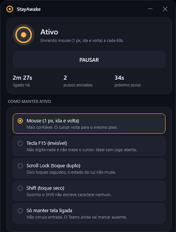

# StayAwake

Utilitário de bandeja para Windows que impede que o Teams, Slack, Discord e outros aplicativos
alterem o status para Ausente por inatividade.


## Funcionamento

Esses aplicativos determinam inatividade pelo contador do Windows exposto em `GetLastInputInfo`,
que informa o tempo decorrido desde a última entrada de teclado ou mouse. O StayAwake emite
periodicamente um evento de entrada sintético por `SendInput`, o que zera esse contador.

O evento é dimensionado para não produzir efeito colateral: deslocamento de 1 pixel do cursor com
retorno imediato à posição original, ou tecla sem função atribuída no Windows (F15). Nenhum
caractere é inserido e a posição final do cursor é idêntica à inicial.

Medição na máquina de teste: contador de inatividade em 59 s imediatamente antes do pulso e 0 s
logo após a emissão.

## Interface

<p align="center">
  
</p>

## Recursos

| Recurso | Descrição |
| --- | --- |
| **Métodos de pulso** | Mouse de 1 px, tecla F15, Scroll Lock em toque duplo, Shift, ou apenas retenção de energia |
| **Modo inteligente** | Emite o pulso somente após um limite configurável de inatividade real do usuário |
| **Intervalo** | Predefinições de 30 s, 1, 2 e 4 min, ou valor arbitrário entre 5 s e 1 h |
| **Retenção de energia** | `SetThreadExecutionState` impede suspensão do sistema e desligamento do monitor |
| **Desligamento automático** | Encerra a operação após N minutos |
| **Janela de horário** | Opera apenas dentro da faixa configurada, incluindo faixas que cruzam a meia-noite |
| **Ícone de bandeja** | Cor conforme o estado, com menu de ativar, pausar, emitir pulso e encerrar |
| **Início com o Windows** | Registro em `HKCU\Software\Microsoft\Windows\CurrentVersion\Run`, sem privilégio elevado |

O painel exibe tempo de operação, contagem de pulsos emitidos, tempo até o próximo pulso e log de
eventos.

## Modo inteligente

Os pulsos emitidos pelo próprio aplicativo também zeram o contador do sistema, o que impede
distinguir atividade do usuário de atividade sintética apenas por `GetLastInputInfo`. O StayAwake
registra o instante de cada pulso emitido e classifica como entrada do usuário somente os eventos
ocorridos fora da janela de tolerância desse instante. Com isso o tempo de inatividade real
permanece correto durante a operação, e o pulso é suprimido enquanto o usuário estiver ativo.

## Download

Executável disponível em [Releases](../../releases/latest). Arquivo único, sem instalador e sem
dependência de runtime instalado.

## Compilação

Requer o [.NET 8 SDK](https://dotnet.microsoft.com/download/dotnet/8.0).

```bash
dotnet run -c Release
```

Geração dos executáveis distribuíveis:

```bash
pwsh tools/publish.ps1
```

Saída em `dist/`:

- `dist/portatil/StayAwake.exe`: self-contained, arquivo único, 63 MB, sem dependências externas.
- `dist/leve/StayAwake.exe`: framework-dependent, 260 KB, requer o .NET 8 Desktop Runtime.

Consumo em bandeja: cerca de 32 MB de working set e CPU ociosa. O working set da interface é
devolvido ao sistema por `EmptyWorkingSet` quando a janela é ocultada.

## Configuração

Persistida em `%APPDATA%\StayAwake\settings.json`, gravada a cada alteração.

## Limites

- **Sessão bloqueada**: com a estação de trabalho bloqueada o status é alterado para Ausente
  independentemente da entrada simulada, pois a sessão do usuário fica inativa. O aplicativo detecta
  o evento `SessionLock` e registra a condição no log. Em ambientes com bloqueio por política de
  inatividade, configure o intervalo abaixo do tempo limite da política.
- **Nível de integridade**: se a janela em primeiro plano executar com privilégio elevado e o
  StayAwake não, o `SendInput` é descartado pelo mecanismo UIPI. A falha é registrada no log.
  Executar o StayAwake com o mesmo nível de privilégio resolve a condição.
- **Escopo**: a atuação se restringe ao contador de inatividade do sistema. Não há interação com a
  API de presença do Teams nem com o estado de reuniões.

## Estrutura

```
Core/
  NativeMethods.cs    interop Win32 (SendInput, GetLastInputInfo, SetThreadExecutionState)
  InputPulser.cs      emissão do pulso, uma implementação por método
  IdleWatcher.cs      leitura do contador de inatividade, tratando o estouro de 32 bits
  PowerKeeper.cs      retenção de energia e de vídeo
  AwakeEngine.cs      temporização, janela de horário, desligamento automático e log
  AppSettings.cs      modelo de configuração e persistência em JSON
  StartupManager.cs   registro de início automático em HKCU
  TrayIconFactory.cs  geração do ícone de bandeja em tempo de execução
  MemoryTrimmer.cs    liberação de working set ao ocultar a janela
MainWindow.xaml       painel
Themes/Controls.xaml  tema e estilos de controle
tools/                gerador de ícone e script de publicação
```

## Licença

MIT. Copyright (c) 2026 [LICENSE](LICENSE).

## Autor

Criado por João Pedro Villas Boas de Carvalho.
