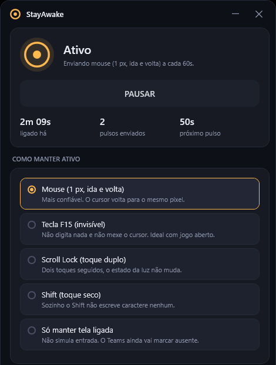
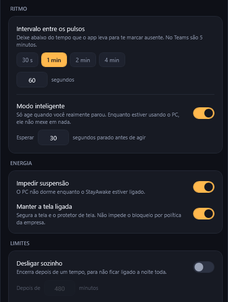
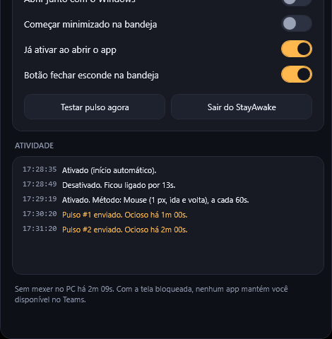

# StayAwake

App de bandeja para Windows que mantém você aparecendo como **Disponível** no Teams, Slack, Discord
e qualquer outro programa que troque o status para *Ausente* depois de um tempo sem interação.


## Como funciona

Teams, Slack e o próprio Windows decidem quem está ausente olhando o mesmo contador do sistema
(`GetLastInputInfo`). De tempos em tempos o StayAwake envia a menor entrada possível — 1 pixel de
mouse, ida e volta, ou uma tecla que nenhum teclado físico tem — e esse contador volta a zero.
Nenhum caractere é digitado e o cursor termina exatamente onde estava.

## Screenshots

<p align="center">
  
</p>

<p align="center">
  
  
</p>

## Recursos

| Recurso | Para que serve |
| --- | --- |
| **5 métodos de pulso** | Mouse de 1 px, tecla F15, Scroll Lock duplo, toque de Shift ou apenas segurar a tela |
| **Modo inteligente** | Só age depois de X segundos com você realmente parado, sem atrapalhar quem está usando o PC |
| **Intervalo livre** | Atalhos de 30s, 1, 2 e 4 min, ou qualquer valor entre 5s e 1h |
| **Impedir suspensão** | Segura o sono do sistema e o protetor de tela enquanto estiver ligado |
| **Desligar sozinho** | Encerra depois de N minutos, para não passar a noite ligado |
| **Somente no horário** | Fica em espera fora da faixa configurada, inclusive faixas que cruzam a meia-noite |
| **Ícone na bandeja** | Muda de cor conforme o estado, com menu de ativar, pausar, pulsar e sair |
| **Abrir com o Windows** | Inicia minimizado na bandeja, usando só a chave `Run` do seu usuário |

O painel mostra há quanto tempo está ligado, quantos pulsos saíram, quanto falta para o próximo e
um log do que aconteceu.

## Download

Baixe o executável pronto na aba [Releases](../../releases/latest) — arquivo único, sem instalador,
roda em qualquer Windows 10/11 sem precisar instalar nada.

## Compilando

Precisa do [.NET 8 SDK](https://dotnet.microsoft.com/download/dotnet/8.0).

```bash
dotnet run -c Release
```

Para gerar os executáveis distribuíveis:

```bash
pwsh tools/publish.ps1
```

Isso cria duas pastas em `dist/`:

- `dist/portatil/StayAwake.exe`, arquivo único que roda em qualquer Windows 10/11 sem instalar nada.
- `dist/leve/StayAwake.exe`, bem menor, mas exige o .NET 8 Desktop Runtime na máquina.

Escondido na bandeja o app devolve a memória da interface para o Windows e fica em torno de 30 MB
de RAM, com uso de CPU perto de zero.

## Configuração

Fica em `%APPDATA%\StayAwake\settings.json` e é gravada sozinha a cada alteração.

## Limites honestos

- **Tela bloqueada não tem jeito.** Com o Windows bloqueado o Teams marca ausente independentemente
  do que qualquer app faça, porque a sessão é considerada travada. O StayAwake avisa isso no log
  quando detecta o bloqueio. Se a política da empresa bloqueia a tela por inatividade, use um
  intervalo menor que esse tempo.
- **Janela de administrador em foco.** Se o programa em primeiro plano rodar elevado e o StayAwake
  não, o Windows recusa a entrada simulada (UIPI). O log mostra o aviso. A solução é rodar o
  StayAwake como administrador também.
- **Reunião não é status.** O app mantém a presença, não simula participação em nada.

## Estrutura

```
Core/
  NativeMethods.cs    interop Win32 (SendInput, GetLastInputInfo, SetThreadExecutionState)
  InputPulser.cs       envio do pulso, um método por estratégia
  IdleWatcher.cs        leitura do contador de ociosidade, à prova do estouro de 49 dias
  PowerKeeper.cs        trava de energia e de tela
  AwakeEngine.cs        relógio do app: horário, desligamento automático, modo inteligente, log
  AppSettings.cs        configuração e persistência em JSON
  StartupManager.cs     chave Run do usuário
  TrayIconFactory.cs    ícone da bandeja desenhado em tempo de execução
  MemoryTrimmer.cs      libera memória quando o app vai para a bandeja
MainWindow.xaml          painel
Themes/Controls.xaml     tema escuro e controles
tools/                   gerador de ícone e script de publicação
```

## Licença

[MIT](LICENSE) — João Pedro Villas Boas de Carvalho ([@johncarvalhonx](https://github.com/johncarvalhonx))
